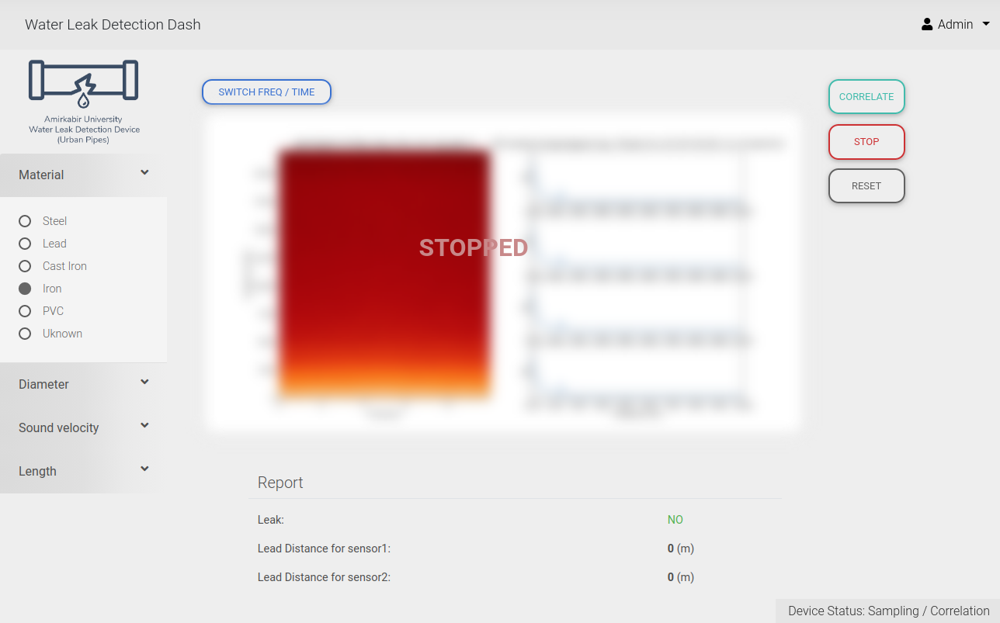

# the dashboard and dsp algortihm

## wiki
- the main code of dsp croos-correlation algorithm is in ```corr``` folder
- to make the code work altogether there should be recorder which dumps the ```node1-14.wav``` and replaces the original ones

## how to use
- run ```python3 main.py```


<!--  { width: 400px; } -->
